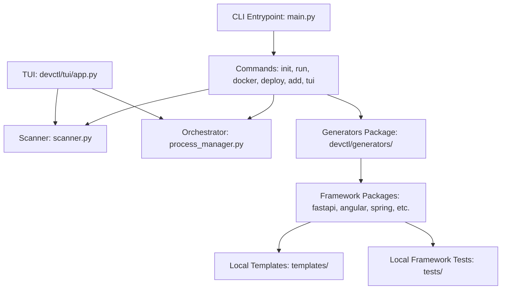

# Architecture Guide

This document describes the design, directory layout, and orchestration
mechanisms of the `devctl` developer tool. Use this guide to understand how
the system scans local directories, boots service environments, executes modular code
generators, and powers the interactive Terminal User Interface (TUI).

---

## Architecture Overview

The `devctl` application is structured into four functional layers: the
Command-Line Interface (CLI) controller, the Orchestrator Engine, the Modular Code
Generators, and the Interactive TUI. It operates as a local daemon-less utility
run directly within a project repository.



---

## Functional Layers

### 1. CLI entrypoint
The entrypoint for execution is located in
[main.py](file:///home/youssef/Projects/Personal/Apps/devctl/devctl/main.py).
It instantiates the primary `typer.Typer` command registry. The command groups
are organized under [devctl/commands/](file:///home/youssef/Projects/Personal/Apps/devctl/devctl/commands/)
as follows:
* [init.py](file:///home/youssef/Projects/Personal/Apps/devctl/devctl/commands/init.py):
  Handles boilerplate generation and initial project setup.
* [run.py](file:///home/youssef/Projects/Personal/Apps/devctl/devctl/commands/run.py):
  Launches all detected backend, frontend, and database services in parallel.
* [add.py](file:///home/youssef/Projects/Personal/Apps/devctl/devctl/commands/add.py):
  Scaffolds domain entities and endpoints.
* [docker.py](file:///home/youssef/Projects/Personal/Apps/devctl/devctl/commands/docker.py):
  Generates project-level `Dockerfiles` for local containerization.
* [deploy.py](file:///home/youssef/Projects/Personal/Apps/devctl/devctl/commands/deploy.py):
  Aggregates multiple services into a single production compose script.
* [tui.py](file:///home/youssef/Projects/Personal/Apps/devctl/devctl/commands/tui.py):
  Instantiates the interactive Textual interface.

### 2. Orchestration engine
The process scanning and management logic is isolated under
[devctl/orchestrator/](file:///home/youssef/Projects/Personal/Apps/devctl/devctl/orchestrator/):

* **Repository Scanning**:
  [scanner.py](file:///home/youssef/Projects/Personal/Apps/devctl/devctl/orchestrator/scanner.py)
  scans directories to identify language structures (such as `package.json` for
  Node.js runtimes or `pom.xml` for Java Spring Boot projects) and active database
  compose configurations (`docker-compose-db.yml`).
* **Process Management**:
  [process_manager.py](file:///home/youssef/Projects/Personal/Apps/devctl/devctl/orchestrator/process_manager.py)
  wraps subprocess executions inside `subprocess.Popen`. It leverages thread-locked
  I/O queues to pipe standard output and error streams into memory logs.
  Additionally, it queries the operating system kernel via `psutil` to retrieve
  CPU percentage and resident memory allocations (RSS) for both parent and child
  processes.

### 3. Modular Code Generators & Self-Contained Packages
Code scaffolding utilities reside in subdirectories under
[devctl/generators/](file:///home/youssef/Projects/Personal/Apps/devctl/devctl/generators/).

Each framework operates as a **100% self-contained module** combining code, templates, and unit tests:
```text
devctl/generators/<framework>/
├── __init__.py         # Exposes clean public API (e.g. generate_*_boilerplate, generate_*_resource)
├── generator.py        # Project setup & dependency installation
├── scaffolder.py       # Entity & resource scaffolding
├── templates/          # Jinja2 template files (.j2)
│   ├── config/         # Boilerplate configuration templates
│   └── resource/       # Component, router, model & service templates
└── tests/              # Local framework unit tests
    ├── __init__.py
    └── test_<framework>.py
```

Supported framework packages include:
- `angular`, `django`, `docker`, `fastapi`, `go_fiber`, `nestjs`, `nextjs`, `nodejs`, `react`, `spring`, `svelte`, `vue`

### 4. Interactive TUI
The user interface is powered by `Textual` and resides under
[devctl/tui/](file:///home/youssef/Projects/Personal/Apps/devctl/devctl/tui/):
* [app.py](file:///home/youssef/Projects/Personal/Apps/devctl/devctl/tui/app.py):
  The core `DevctlTUI` application controller. It schedules periodic status checks,
  intercepts keystrokes, and updates layouts.
* [app.tcss](file:///home/youssef/Projects/Personal/Apps/devctl/devctl/tui/app.tcss):
  Defines the styling system. It restricts interface heights to clean single-cell
  rows, eliminates blocky widget borders, and establishes highlight schemes for active items.

---

## Core Workflows

### Process execution and log streaming
When you trigger a service action in the TUI:
1. `DevctlTUI` forwards the command to `ProcessManager.start_service` or
   `ProcessManager.stop_service` in
   [process_manager.py](file:///home/youssef/Projects/Personal/Apps/devctl/devctl/orchestrator/process_manager.py).
2. The orchestrator spawns a thread to read the process output streams and
   appends the lines to the `ServiceState.logs` buffer using a `threading.Lock`.
3. In [app.py](file:///home/youssef/Projects/Personal/Apps/devctl/devctl/tui/app.py),
   `stream_new_logs` polls the log buffers every 200 milliseconds and writes
   them to the active console screen.

### System metrics polling
1. The TUI schedules a timer to execute `refresh_stats` every second.
2. `ProcessManager.update_metrics` executes, requesting CPU and memory stats
   from `psutil`.
3. The raw percentages are mapped to text-based bar meters using `make_bar` in
   [app.py](file:///home/youssef/Projects/Personal/Apps/devctl/devctl/tui/app.py).

---

## Code Reference Directory

Use the links below to inspect specific sections of the implementation:

* **Entrypoint & Subcommands Setup**:
  [main.py](file:///home/youssef/Projects/Personal/Apps/devctl/devctl/main.py#L1-L20)
* **Framework Package Structure**:
  [devctl/generators/](file:///home/youssef/Projects/Personal/Apps/devctl/devctl/generators/)
* **Process manager thread loops**:
  [process_manager.py:L130-L170](file:///home/youssef/Projects/Personal/Apps/devctl/devctl/orchestrator/process_manager.py#L130-L170)
* **System statistics calculation**:
  [process_manager.py:L227-L260](file:///home/youssef/Projects/Personal/Apps/devctl/devctl/orchestrator/process_manager.py#L227-L260)
* **Custom progress bar rendering**:
  [app.py:L76-L101](file:///home/youssef/Projects/Personal/Apps/devctl/devctl/tui/app.py#L76-L101)
* **TUI page composition logic**:
  [app.py:L127-L287](file:///home/youssef/Projects/Personal/Apps/devctl/devctl/tui/app.py#L127-L287)
* **Keyboard navigation events**:
  [app.py:L433-L457](file:///home/youssef/Projects/Personal/Apps/devctl/devctl/tui/app.py#L433-L457)
* **CLI stylesheet and theme**:
  [app.tcss](file:///home/youssef/Projects/Personal/Apps/devctl/devctl/tui/app.tcss)
